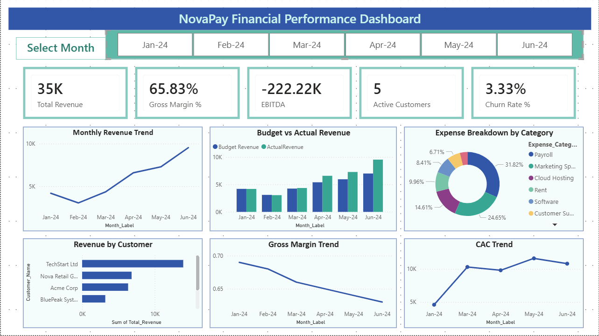

# AI-Enabled FP&A Command Center

## NovaPay Financial Performance Dashboard

This project is an end-to-end FP&A and finance analytics project built for NovaPay, a fictional fintech company. The goal of the project is to create a complete financial performance reporting system that helps track revenue, budget performance, expenses, profitability, customer metrics, and forecasting insights.

The project follows a full analytics workflow using Excel, SQL, Python, Power BI, executive reporting, and presentation design. It starts with raw business data, builds a structured financial model, performs SQL-based analysis, supports forecasting through Python, and presents the final insights through an interactive Power BI dashboard, executive report, and portfolio-ready presentation deck.

---

## Project Objective

The objective of this project is to build a practical FP&A reporting solution that helps business leaders monitor financial performance and make better decisions.

The project focuses on:

* Tracking monthly revenue performance
* Comparing actual revenue against budget
* Reviewing EBITDA and profitability trends
* Analyzing major expense categories
* Monitoring gross margin, churn rate, CAC, and active customers
* Identifying key revenue-contributing customers
* Supporting forecasting and trend analysis
* Creating an interactive Power BI dashboard for monthly reporting
* Preparing final business insights, recommendations, and executive-ready documentation

---

## Tools Used

| Tool       | Purpose                                                                           |
| ---------- | --------------------------------------------------------------------------------- |
| Excel      | Financial model, cleaned data tables, date table, and structured inputs           |
| SQL        | Business queries for revenue, budget, expenses, KPIs, and customer-level analysis |
| Python     | Forecasting, trend analysis, and supporting analytics                             |
| Power BI   | Interactive dashboard and data visualization                                      |
| Word / PDF | Executive report and project documentation                                        |
| PowerPoint | Final presentation deck                                                           |

---

## Folder Structure

```text
AI_Enabled_FPA_Command_Center
│
├── 01_Data
│   ├── budget.csv
│   ├── customers.csv
│   ├── expenses.csv
│   ├── kpi_metrics.csv
│   ├── revenue.csv
│   └── scenario_inputs.csv
│
├── 02_Excel_Model
│   └── NovaPay_FPA_Model.xlsx
│
├── 03_SQL
│   └── NovaPay_SQL_Queries.sql
│
├── 04_Python
│   └── NovaPay_Forecasting_Notebook.ipynb
│
├── 05_PowerBI
│   └── NovaPay_Financial_Dashboard.pbix
│
├── 06_Reports
│   ├── NovaPay_Executive_Report.docx
│   ├── NovaPay_Executive_Report.pdf
│   └── Dashboard_Screenshots
│       ├── Full_Dashboard.png
│       ├── Jan24_Filter.png
│       ├── Mar24_Filter.png
│       └── Jun24_Filter.png
│
├── 07_Presentation
│   └── NovaPay_FPA_Dashboard_Presentation.pptx
│
├── 08_Screenshots
│   ├── Dashboard_Full_View.png
│   ├── Dashboard_Jan24_Filter.png
│   ├── Dashboard_Mar24_Filter.png
│   ├── Dashboard_Jun24_Filter.png
│   ├── Presentation_Key_Insights_Slide.png
│   ├── Presentation_Title_Slide.png
│   └── Report_Cover_Page.png
│
├── 09_ReadMe_Notes
│   └── README_Notes.txt
│
└── README.md
```

---

## Dashboard Preview

The Power BI dashboard provides a consolidated view of NovaPay’s financial performance from Jan-24 to Jun-24.



---

## Dashboard Features

The dashboard is designed to give a quick executive-level view of financial and operating performance.

Key dashboard components include:

* Month slicer for interactive filtering
* KPI cards for total revenue, gross margin, EBITDA, active customers, and churn rate
* Monthly revenue trend
* Budget vs actual revenue comparison
* Expense breakdown by category
* Revenue by customer
* Gross margin trend
* CAC trend

The dashboard allows users to filter by month and quickly understand how revenue, expenses, profitability, and customer metrics changed during the analysis period.

---

## Data Used

The project uses monthly business data from Jan-24 to Jun-24. The main datasets include:

| Dataset         | Description                                                                                                      |
| --------------- | ---------------------------------------------------------------------------------------------------------------- |
| Revenue         | Monthly revenue by customer and revenue type                                                                     |
| Budget          | Budgeted revenue and budgeted EBITDA                                                                             |
| Expenses        | Monthly expense categories such as payroll, marketing, cloud hosting, rent, software, and customer support       |
| KPI Metrics     | Gross margin, churn rate, CAC, active customers, lost customers, new customers, average revenue, and net revenue |
| Customers       | Customer ID and customer name mapping                                                                            |
| Scenario Inputs | Base, upside, and downside assumptions used for planning                                                         |
| Date Table      | Month-level date structure used for analysis and dashboard filtering                                             |

---

## Key Insights

The analysis highlights several important financial and operational trends:

* Revenue increased across the analysis period, with the highest revenue shown in Jun-24.
* Actual revenue can be compared against budget to identify monthly performance gaps.
* EBITDA remained negative during the period because operating expenses were higher than revenue.
* Gross margin declined from the beginning to the end of the analysis period, showing profitability pressure.
* Payroll and marketing spend were the largest expense categories.
* Revenue was concentrated among a few major customers, especially TechStart Ltd and Nova Retail Group.
* CAC increased during higher-growth months, making acquisition efficiency an important area to monitor.

---

## Business Recommendations

Based on the analysis, the following actions would help improve financial performance:

* Review high operating expense categories to improve EBITDA.
* Monitor CAC closely to ensure customer acquisition remains efficient.
* Reduce customer concentration risk by expanding revenue across more customers.
* Track budget vs actual performance every month to identify gaps early.
* Use the Power BI dashboard as a recurring management reporting tool.
* Improve forecasting accuracy as more monthly data becomes available.

---

## Analytics Workflow

The project was built using a structured analytics workflow:

1. Raw business data was prepared in CSV format.
2. Excel was used to create the financial model and organize structured data tables.
3. SQL queries were written to analyze revenue, budget, expense, KPI, and customer-level performance.
4. Python was used for forecasting and trend-based analysis.
5. Power BI was used to build the interactive dashboard.
6. A final executive report and presentation deck were prepared to summarize the project findings.

---

## How to Open the Files

Use the following files to review the project:

* Open `01_Data` to view the raw CSV datasets.
* Open `02_Excel_Model/NovaPay_FPA_Model.xlsx` to review the financial model.
* Open `03_SQL/NovaPay_SQL_Queries.sql` to view the SQL analysis.
* Open `04_Python/NovaPay_Forecasting_Notebook.ipynb` to review the forecasting notebook.
* Open `05_PowerBI/NovaPay_Financial_Dashboard.pbix` in Power BI Desktop to view the dashboard.
* Open `06_Reports/NovaPay_Executive_Report.pdf` to read the final executive report.
* Open `07_Presentation/NovaPay_FPA_Dashboard_Presentation.pptx` to view the final presentation deck.
* Open `08_Screenshots` to view dashboard, report, and presentation screenshots.

---

## Final Deliverables

This repository includes:

* Raw data files
* Excel FP&A model
* SQL analysis file
* Python forecasting notebook
* Power BI dashboard file
* Executive report
* Presentation deck
* Dashboard and project screenshots
* Supporting README notes

---

## Author

**Srushti Mahant Pawar**

FP&A Analytics Portfolio Project
Excel | SQL | Python | Power BI | Financial Reporting
